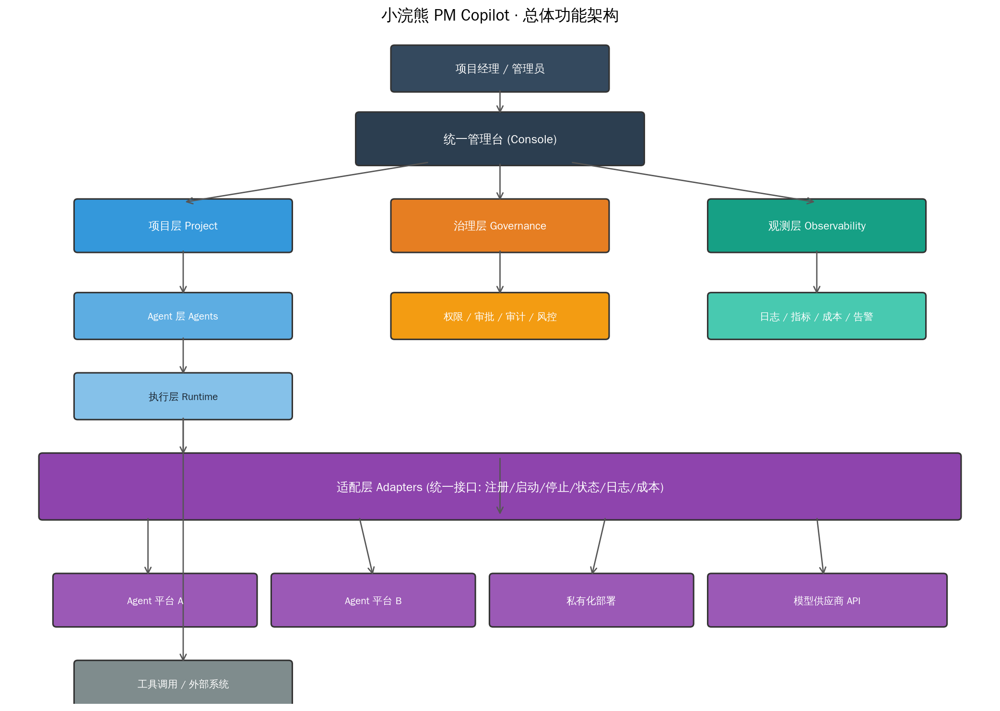

# 小浣熊 PM Copilot

> 面向项目经理的 AI Agent 统一管理平台 · Demo 版  
> 设计原则：**一个核心控制台 + 多平台适配器**



---

## 快速开始

### 本地开发（推荐）

```bash
# 后端
cd backend
pip install -r requirements.txt
cp .env.example .env      # 按需修改
uvicorn main:app --reload --port 8000
# 浏览器访问 http://localhost:8000/docs

# 前端（新窗口）
cd frontend
npm install
npm run dev
# 浏览器访问 http://localhost:5173
```

> Vite 已配置 `/api` 代理到 `http://localhost:8000`，开发时无需额外 CORS 配置。

---

### Docker 一键启动

```bash
docker compose up --build
# 后端: http://localhost:8000
# 前端: http://localhost:5173
```

---

## 核心功能

| 页面 | 路径 | 说明 |
|------|------|------|
| 总览 | `/` | 项目数、Agent 数、运行任务、今日成本、趋势图 |
| 项目 | `/projects` | 项目列表，支持分页筛选 |
| Agent | `/agents` | Agent 列表，按平台/状态筛选，适配层注册 |
| 运行 | `/runtime` | 执行 Trace、调用链时间线 |
| 治理 | `/governance` | 预算额度、审批流、熔断开关、黑白名单 |
| 审计 | `/audit` | 操作日志，支持分页 + 按人筛选 + CSV 导出 |

---

## 架构亮点

### 适配层设计

`backend/adapters/` 定义了统一接口 `BaseAdapter`，新增 Agent 平台只需实现：

```python
class BaseAdapter(ABC):
    def register(agent_config) -> str   # 注册 Agent
    def start(agent_id, payload) -> str # 启动运行
    def stop(run_id) -> bool            # 停止运行
    def status(run_id) -> dict         # 查询状态
    def logs(run_id) -> List[dict]     # 拉取调用链
    def cost(run_id) -> dict           # 导出成本
```

已内置示例：`platform_a.py`、`platform_b.py`。

---

## 环境变量

后端支持通过 `.env` 文件配置（参考 `backend/.env.example`）：

| 变量 | 默认值 | 说明 |
|------|--------|------|
| `HOST` | `0.0.0.0` | 服务监听地址 |
| `PORT` | `8000` | 服务端口 |
| `DEBUG` | `false` | 调试模式 |
| `CORS_ORIGINS` | `localhost:5173,localhost:3000` | 允许的跨域域名 |

---

## 项目结构

```
pm-copilot/
├── docker-compose.yml   # Docker 一键部署
├── frontend/
│   ├── Dockerfile        # 前端 Nginx 镜像
│   ├── nginx.conf       # 生产 Nginx 配置
│   └── src/
│       ├── api/         # API 请求封装（含分页）
│       └── views/       # 6 个业务页面
├── backend/
│   ├── Dockerfile       # 后端 Python 镜像
│   ├── .env.example     # 环境变量模板
│   └── adapters/        # 适配层抽象
└── docs/                # 架构图、线框图、效果图
```

---

## License

MIT
